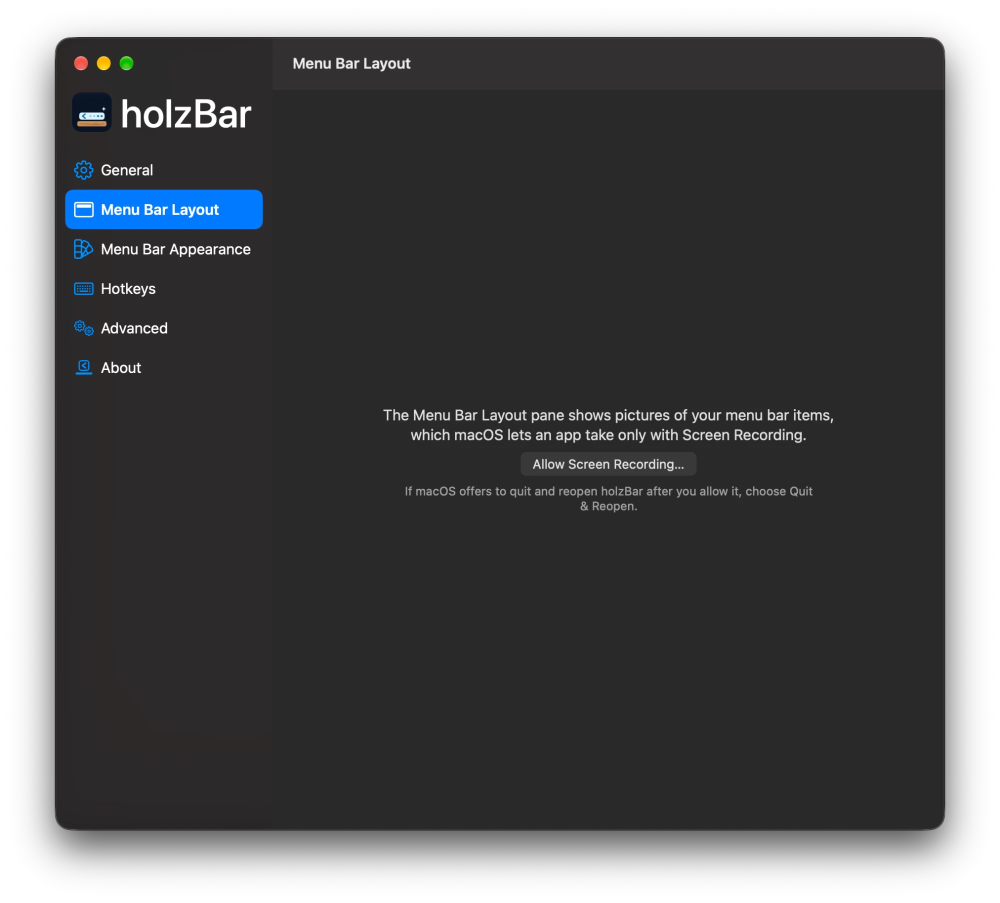
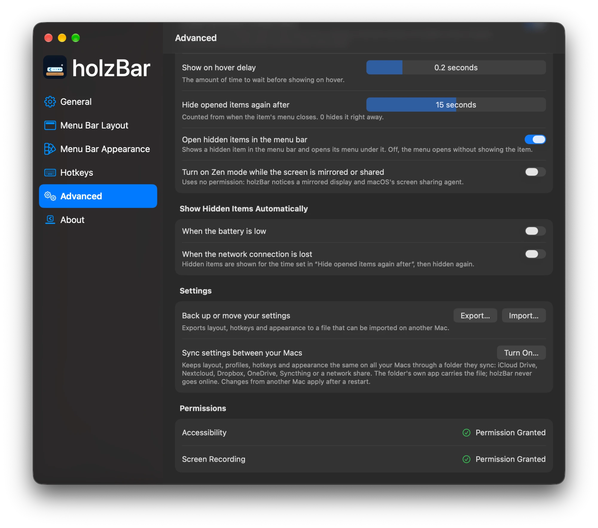

<div align="center">


<br>

[](https://github.com/holzcloud/holzBar/releases)
[](#-install)
[](#-macos-27)
[](#-principles)
[](LICENSE)
[](https://holzcloud.ch/holzbar)
[](https://github.com/sponsors/holzcloud)

**holzBar** keeps your menu bar tidy: hide what you don't need, reveal it when you do,<br>
and make the bar look the way you like — on the notch, on every display, on macOS 27.

**[🌐 holzcloud.ch/holzbar](https://holzcloud.ch/holzbar)**

[Install](#-install) · [Principles](#-principles) · [macOS 27](#-macos-27) · [Features](#-features) · [Gallery](#-gallery) · [Troubleshooting](#-troubleshooting) · [Credits](#-credits)

</div>

---

> [!IMPORTANT]
> ### 🪵 holzBar is a fork of the wonderful [Ice](https://github.com/jordanbaird/Ice) by [Jordan Baird](https://github.com/jordanbaird)
> Ice is one of the best menu bar managers ever made for the Mac, and nearly everything you see here is Jordan's work.
> holzBar only keeps it going on macOS 27 while upstream development is slow. **If you enjoy holzBar, please ⭐ star
> [Ice](https://github.com/jordanbaird/Ice) and consider [sponsoring Jordan](https://github.com/sponsors/jordanbaird).**
> holzBar is independent and not affiliated with or endorsed by the Ice project.

## ✨ Why holzBar?

holzBar is a community fork of [Ice](https://github.com/jordanbaird/Ice) by Jordan Baird. Ice is a fantastic tool, but its development has slowed down — and macOS 27 broke it for me. holzBar picks it up from there:

| | |
|---|---|
| 📦 **Zero dependencies** | No third-party packages at all — every line that runs is in this repository. |
| 🦅 **Modern Swift 6** | **Built with Swift 6.4 and Xcode 27**, the latest stable Swift and the macOS 27 SDK, in Swift 6 language mode with data-race safety checked by the compiler; main actor by default with `@concurrent` background work, `@Observable` instead of Combine, one backend per macOS generation. |
| 🔒 **Never online** | No update checks, telemetry or analytics. A CI check proves there is no network code in the app. |
| 🛡️ **Least privilege** | Only Accessibility at first launch; Screen Recording only when a feature needs it. Hardened runtime, private logs. |
| 🍃 **Lean** | No polling where macOS sends an event, no mouse tracking unless you use it, nothing kept in memory that nobody shows. |
| 🪵 **macOS 27 compatible** | A dedicated backend for the redesigned macOS 27 menu bar drawn by `MenuBarAgent`. |
| ✅ **macOS 14 to 27, checked** | Every pull request launches the app on macOS 14, 15, 26 and 27 and runs the 371 unit tests on each. |
| ✨ **More features** | Profiles, folders, spacers, Zen mode, Shortcuts actions, a black menu bar, URL commands, settings sync through any folder — [see below](#-features). |
| 🌍 **Five languages** | English, German, French, Italian and Romansh. |
| 🍺 **Homebrew first** | Install and update with one command. |

## ⚖️ holzBar vs. Ice and Thaw

What the original [Ice](https://github.com/jordanbaird/Ice) 0.11.12 and the other active fork [Thaw](https://github.com/thaw-app/Thaw) 3.0 beta do, and what holzBar adds. 🔜 marks work in progress in this beta; — means not available or not documented.

| | Ice 0.11.12 | Thaw 3.0 beta | holzBar |
|---|:---:|:---:|:---:|
| **Compatibility** | | | |
| macOS 14 – 26 | ✅ | macOS 26 only | ✅ |
| **macOS 27** (new menu bar drawn by `MenuBarAgent`) | ❌ | ✅ | ✅ |
| Launched and unit tested in CI on every supported macOS | ❌ | — | ✅ 14, 15, 26 and 27 |
| **Features** | | | |
| Hidden and always-hidden sections, Ice Bar / holzBar Shelf, search, appearance | ✅ | ✅ | ✅ |
| Layout profiles | ❌ | ✅ | ✅ |
| Groups and spacers | ❌ | ✅ | ✅ |
| Folders with their own icon and colour; item images of your choice | ❌ | ✅ | ✅ |
| Choose where new items appear | ❌ | — | ✅ |
| Bar only on some displays, notch overflow | ❌ | — | ✅ |
| Black menu bar, rounded screen corners | ❌ | corners only | ✅ |
| Dashed and dotted borders, wallpaper, accent and glass tints | ❌ | ✅ | ✅ |
| Show hidden items on low battery or when offline | ❌ | — | ✅ |
| URL commands and Raycast | ❌ | ✅ | ✅ |
| Zen mode (also while presenting) | ❌ | ✅ | ✅ |
| Hotkeys per profile and per item | ❌ | ✅ | ✅ |
| Shortcuts actions (App Intents) | ❌ | ✅ | ✅ |
| Profiles bound to a display or a Space | ❌ | ✅ | ✅ |
| Open an item by letter | ❌ | ✅ | ✅ |
| Layout editor and Shelf from the keyboard, undo, VoiceOver actions | ❌ | ✅ | ✅ |
| Opened items stay up to 30 s, or open without showing the item | ❌ | ✅ | ✅ |
| Show an item briefly when it changes | ❌ | ✅ | ✅ <sub>opt-in per item</sub> |
| Export and import settings | ❌ | ✅ | ✅ |
| Settings sync: iCloud Drive or any synced folder | ❌ | ❌ | ✅ |
| Languages | English | many, through Crowdin | English, German, French, Italian, Romansh |
| Keep Live Activities visible | ❌ | — | ✅ <sub>experimental</sub> |
| Show on scroll with a mouse wheel | ❌ | — | ✅ |
| Search tolerates typos and abbreviations | ✅ (library) | ✅ | ✅ (built in) |
| Refuses hotkeys macOS cannot register, and says why | ❌ | — | ✅ |
| Input never stalls when an app hangs | ❌ | ✅ | ✅ |
| Items keep their section when an app changes its title | ❌ | ✅ | ✅ |
| Pauses while the screen is locked, settles after wake | ❌ | ✅ | ✅ |
| Look on every desktop, follows the icons, steps aside in fullscreen | ❌ | ✅ | ✅ |
| No screen-recording indicator when showing or hiding (macOS 27) | — | ✅ | ✅ |
| Hover and click on a second display (macOS 27) | — | ✅ | ✅ |
| URL commands ask before they change anything lasting; no URL ends Zen mode during a screen share | — | — | ✅ |
| Validated hotkeys, colours and numbers in imported and synced settings (no crash loop from bad settings) | ❌ | — | ✅ |
| **Privacy and permissions** | | | |
| Network connections (update checks, telemetry, analytics) | Sparkle update checks | Sparkle update checks | **none** — enforced by CI |
| Personal data (app names, item titles, paths) in logs | partly public | — | private, enforced by CI |
| Asks for Screen Recording only when a feature needs it | ❌ | — | ✅ |
| Hardened runtime (no injected code or libraries) | ✅ | ✅ | ✅ (checked by CI) |
| Settings import accepts only known keys of the right type, in range | — (no import) | — | ✅ |
| Settings import and sync can't turn sync on; the sync file carries no computer name | — (no sync) | — | ✅ |
| Menu bar item service accepts only holzBar's own code | team check only | — | team or exact code hash |
| Fix for the permissions loop | ❌ | — | ✅ |
| **Code and resources** | | | |
| Swift packages | 5 | 10 (Sparkle, AXSwift6, CompactSlider, Ifrit, LaunchAtLogin-Modern and 5 from Apple) | **none** |
| Swift language mode | Swift 5 | Swift 6 | Swift 6 (data-race safety checked by the compiler), built with Swift 6.4 and Xcode 27 |
| State management | Combine | `@Observable` and Combine | `@Observable`, no Combine |
| Mouse event tap when "Show on hover" is off | always running | — | off |
| Timers and polling while nothing is shown | yes | — | only while needed |
| Settings sync checks for changes | — (no sync) | — (no sync) | when the synced folder delivers them, no polling |
| Settings migration | 6 version steps at every launch | — | once, while importing Ice settings |
| Runtime patching of AppKit (method swizzling) | yes | yes | none |
| Item images in memory | kept | — | released when unused |
| Unit tests run on every change | none | ✅ | ✅ 371 |
| App size | — | — | 16.7 MB |
| **Distribution and maintenance** | | | |
| Install and update with Homebrew | ✅ | ✅ | ✅ |
| Updates | Sparkle (dialog can hang on macOS 26) | Sparkle | Homebrew |
| Fixes from 282 open bug reports | — | — | [see the list](docs/upstream-bugs.md) |
| Signed with a Developer ID | ✅ | — | ❌ (own certificate instead; the cask handles quarantine) |
| Stable signature, so Accessibility survives updates | ✅ | — | ✅ from 0.0.6-beta1 (own certificate, [docs/signing.md](docs/signing.md)) |
| Build provenance attestation (`gh attestation verify`) | ❌ | — | ✅ from 0.0.6-beta1 |

## 🔒 Principles

Every change to holzBar follows four rules — without taking a feature away:

- **Modern** — written the way a macOS app is written in 2026: current Swift, Swift concurrency and current SwiftUI and AppKit APIs. Outdated APIs are replaced as the code is touched.
- **Lean and fast** — as little CPU, energy, memory and disk as possible; no polling where macOS sends an event; a small app that launches fast.
- **Private** — holzBar never connects to the network: no telemetry, no analytics, no crash reports, no update checks, no remote content. The only exception is a link you click, which opens in your browser. Your data stays on your Mac and out of the logs. To show hidden items when the network drops, holzBar only watches whether a network path is available (Apple's NWPathMonitor); it never opens a connection. The `no-network` check fails every pull request that adds networking code or a third-party package, and every build checks the app's binaries and entitlements for network access.
- **Least privilege** — holzBar asks only for the permissions a feature really needs, when it needs them, and says why.

Where holzBar doesn't meet a rule yet, that is a bug to fix.

### Permissions

Everything holzBar asks macOS for, the feature that needs it and when it is asked:

| Permission or entitlement | Needed for | When |
|---|---|---|
| **Accessibility** <sub>required</sub> | Reading where menu bar items are; moving, showing and clicking them for you; noticing clicks, scrolls and hovers in the menu bar for show on click, scroll and hover | Asked on the first launch |
| **Screen Recording** <sub>optional</sub> | Pictures of menu bar items in the holzBar Shelf, the search and the Menu Bar Layout pane (on macOS 27 taken once per item), and a moving wallpaper beside a menu bar shape (before macOS 27; other wallpapers are read from their file) | Asked the first time you open the holzBar Shelf, the search or the Menu Bar Layout pane, or choose a menu bar shape with a moving wallpaper — never at launch. Without it, everything else works, the holzBar Shelf and the search show app icons, and nothing captures the screen |
| **Login item** | Starting holzBar when you log in | Only when you turn on "Launch at login" |
| **A folder you choose** | Settings sync between your Macs (`holzBar/Settings.plist` in iCloud Drive or any folder your Macs sync, such as Nextcloud, Dropbox, OneDrive, Syncthing or a network share), read and written with file coordination; holzBar keeps a bookmark of the folder, the folder's own app does the syncing | Only while settings sync is on; with sync off, holzBar neither watches the folder nor writes to it |
| **Entitlements** | None. holzBar runs without the App Sandbox, because Accessibility event taps and the menu bar's private WindowServer calls do not work in it, and it has no network entitlement | — |
| **Info.plist usage strings** | None: macOS does not use them for Accessibility and Screen Recording | — |
| **Reset and Grant Again** | Runs `tccutil reset` for holzBar's own entry only, when a stale permission keeps the permissions window open | Only when you click it |

<p align="center"><br><sub>Screen Recording is asked only when a feature needs it, and holzBar says why.</sub></p>

> [!WARNING]
> **macOS 27: the camera, microphone and screen recording indicator.** While holzBar hides menu bar items on macOS 27, Control Centre does not show its privacy indicator — green for the camera, orange for the microphone, indigo for screen sharing or recording. The small green dot beside the clock still appears while the camera is on. The indicator comes back while holzBar hides no item. holzBar needs no permission for this and cannot prevent it: macOS removes the indicator whenever an app hides items the way holzBar must on macOS 27. **Settings → General** says so too.

## 🚀 Install

### Homebrew <sub>(recommended)</sub>

```sh
brew tap holzcloud/holzbar https://github.com/holzcloud/holzBar
brew trust --cask holzcloud/holzbar/holzbar
brew install --cask holzbar
```

`brew trust` is needed once: Homebrew only installs casks from third-party taps that you have trusted.

Update with:

```sh
brew update && brew upgrade --cask holzbar
```

### If macOS says holzBar "can't be opened"

holzBar is signed with its own certificate, not an Apple Developer ID, so Gatekeeper does not know it. The Homebrew cask removes the quarantine flag for you, but if you downloaded the zip yourself — or macOS still blocks the app — take it out of quarantine:

```sh
xattr -dr com.apple.quarantine /Applications/holzBar.app
```

Then open holzBar again. Alternatively: open it once, then go to **System Settings → Privacy & Security** and click **Open Anyway** next to the holzBar message.

From 0.0.6-beta1 on, the release workflow attaches a build provenance attestation to every zip it builds, which proves that the zip was built by this repository's release workflow: `gh attestation verify holzBar-<version>.zip -R holzcloud/holzBar`. The app is signed with holzBar's certificate (SHA-256 `e55f0df15060b8c06c6842ccee85e6bc9f86cbbda3bd408abf991457840b1d95`); `codesign -dv --verbose=4 /Applications/holzBar.app` shows it. See [docs/signing.md](docs/signing.md).

> [!NOTE]
> holzBar replaces the original Ice — quit Ice and run `brew uninstall --cask jordanbaird-ice` first if you have it. Two menu bar managers must never run at the same time; holzBar offers to quit Ice, Thaw, Bartender or Hidden Bar when it finds one running.
> Your Ice settings (layout, hotkeys, appearance) are imported automatically on the first launch.

### Build from source

Use Xcode 27 (macOS 27 SDK), as CI does; holzBar itself runs on macOS 14 or later. Every pull request launches the built app on macOS 14, 15, 26 and 27 and runs the unit tests on each, so a missing symbol or a crash at launch on an older macOS fails the build. CI builds with Xcode 27.0 for the SDK and the official Swift 6.4 toolchain from [swift.org](https://www.swift.org/install/macos/) as the compiler (both pinned in `.github/actions/select-xcode`).

```sh
git clone https://github.com/holzcloud/holzBar
cd holzBar
Scripts/install.sh            # installs to ~/Applications
```

`Scripts/install.sh` builds with Xcode's own Swift. To build with Swift 6.4 like CI (optional), install `swift-6.4.0-RELEASE-osx.pkg` from swift.org for your user only, then select it with `TOOLCHAINS`:

```sh
installer -pkg swift-6.4.0-RELEASE-osx.pkg -target CurrentUserHomeDirectory
TOOLCHAINS=$(plutil -extract CFBundleIdentifier raw -o - \
  ~/Library/Developer/Toolchains/swift-6.4.0-RELEASE.xctoolchain/Info.plist) Scripts/install.sh
```

## 🪵 macOS 27

macOS 27 no longer draws menu bar items as separate windows — `MenuBarAgent` draws them all into one bar. holzBar ships a dedicated backend for it (from [jordanbaird/Ice#995](https://github.com/jordanbaird/Ice/pull/995)):

- **Hiding** via assessment-mode assertions, with per-app sections
- **Item discovery** through Accessibility instead of window lists
- **holzBar Shelf** with real item images and even spacing
- **Layout editor** that assigns apps to sections — your old layout is carried over on first launch
- **A second display** works like the first: hovering and clicking items there opens their menus instead of revealing hidden items
- **Notched MacBooks**: holzBar's icon is kept out from under the notch, and items folded beside the notch come back on a wider display
- **No screenshots under the bar**: no screen-recording indicator when items are shown or hidden, and a click on the clock no longer flashes hidden items

**Known limitations on macOS 27**

- Items can't be reordered on the bar itself — only assigned to sections.
- Opening a system item (clock, battery, Wi-Fi) while hidden items are concealed adds ~150 ms.
- **The privacy indicator is hidden while items are hidden.** Control Centre's indicator for the camera, the microphone and screen recording is not shown while holzBar hides any item; the small green dot beside the clock still shows the camera. It comes back while holzBar hides no item. See [Permissions](#permissions).
- After an update, macOS may ask for Accessibility again. If holzBar is stuck on the permissions window, click **Reset and Grant Again**.

## 🧰 Features

<table>
<tr>
<td valign="top" width="50%">

#### Menu bar items
- ✅ Hide items in a hidden and an always-hidden section
- ✅ Show on hover, click or scroll (trackpad **and mouse wheel**)
- ✅ Automatic rehide
- ✅ Drag-and-drop layout editor
- ✅ **Layout profiles** — "Work", "Home", … one click, hotkey or URL away
- ✅ **Profiles bound to a display or a Space** — applied when you connect the display or switch to the Space
- ✅ **Groups** (folders) — several items behind an icon of their own, in a colour and with a symbol or image of your choice
- ✅ **Item images of your choice** — give any item its own picture, or its app's icon; without Screen Recording, the holzBar Shelf and the search show app icons
- ✅ **Spacers** — empty items of adjustable width
- ✅ **Choose where new items appear**
- ✅ **Keeps items in their section after app updates, title changes and display changes**
- ✅ Search menu bar items — by abbreviation ("cc" for Control Centre) and despite typos
- ✅ **Open an item by letter** — a hotkey shows a letter under every item; type it to open the item's menu
- ✅ **Keyboard and VoiceOver** — arrange items in the Layout pane with the arrow keys, undo with ⌘Z, move items with VoiceOver actions
- ✅ **Opened items stay** up to 30 s after their menu closes — or open without showing the item at all
- ✅ **Show When It Changes** — a marked item shows for 5 s when its title or value changes
- ✅ Item spacing <sub>BETA</sub>

</td>
<td valign="top" width="50%">

#### holzBar Shelf
- ✅ Hidden items in a bar below the menu bar
- ✅ **Only on the built-in display or on displays with a notch**
- ✅ **Shows items the notch covers**
- ✅ **Works from the keyboard** — open it with its hotkey, then the arrow keys, Return and Escape

#### Appearance
- ✅ Tint, shadow, border, rounded and split shapes
- ✅ **Black menu bar that hides the notch**
- ✅ **Rounded screen corners**
- ✅ **Dashed and dotted borders**
- ✅ **Tints from the wallpaper or the accent colour, and the system's glass** <sub>glass on macOS 26 and later</sub>

</td>
</tr>
<tr>
<td valign="top" width="50%">

#### Automation
- ✅ **Show hidden items when the battery is low or the network drops**
- ✅ **Zen mode** — one hotkey, menu item, URL or Shortcuts action keeps hidden items hidden; optionally on while the screen is mirrored or shared, without any permission
- ✅ **Shortcuts actions** — Zen mode, show or hide a section, apply a profile, open an item by name, search
- ✅ **`holzbar://` URL commands** and [Raycast script commands](Integrations/Raycast)
- ✅ Hotkeys for sections, search, the holzBar Shelf, app menus, **auto-rehide**, **a quick peek**, **Zen mode**, **each layout profile** and **each menu bar item**

</td>
<td valign="top" width="50%">

#### Settings
- ✅ **Export and import** all settings
- ✅ **Sync between Macs** through iCloud Drive or any folder your Macs sync (Nextcloud, Dropbox, OneDrive, Syncthing, a network share) — changes from another Mac arrive as soon as the folder delivers them, with no polling
- ✅ **Imports your Ice settings** on first launch
- ✅ Launch at login
- ✅ **English, German, French, Italian and Romansh** — holzBar follows your Mac's language; choose another one for holzBar alone in System Settings → General → Language & Region → Applications

</td>
</tr>
</table>

## 🖼 Gallery

<p align="center"></p>

<table>
<tr>
<td width="50%" valign="top"><b>Hidden</b> — only holzBar's dot in the menu bar<br></td>
<td width="50%" valign="top"><b>holzBar Shelf</b> — hidden items below the menu bar<br></td>
</tr>
<tr>
<td width="50%" valign="top"><b>Menu</b> — right-click the dot for settings, search, Zen mode and updates<br></td>
<td width="50%" valign="top"><b>Rehide and spacing</b> — automatic rehide and item spacing <sub>BETA</sub><br></td>
</tr>
</table>

<table>
<tr>
<td width="50%" valign="top"><b>Layout</b> — drag items into sections, with profiles, groups and spacers<br></td>
<td width="50%" valign="top"><b>Appearance</b> — tint, shadow, border, shapes, a black bar and rounded screen corners<br></td>
</tr>
<tr>
<td width="50%" valign="top"><b>Hotkeys</b> — a shortcut for every frequent action, profile and item<br></td>
<td width="50%" valign="top"><b>Advanced</b> — new items, delays, Zen mode, automatic reveal and settings backup<br></td>
</tr>
<tr>
<td width="50%" valign="top"><b>Sync and permissions</b> — settings sync through any folder your Macs sync, and the state of every permission<br></td>
<td width="50%" valign="top"></td>
</tr>
</table>

## 🛠 Troubleshooting

**"holzBar cannot arrange menu bar items in automatically hidden menu bars."** holzBar can only arrange the items while the menu bar stays visible. Open **System Settings → Control Center**, set **Automatically hide and show the menu bar** to **Never**, arrange your items in holzBar, then set the option back to what you had.

**New items end up in the always-hidden section.** macOS puts new menu bar items at the far left of the bar, which is where the always-hidden section is. Choose where they go in **Settings → Advanced → Place new menu bar items in**.

**holzBar is stuck on the permissions window.** After an update macOS may no longer accept the old permission. Click **Reset and Grant Again** in the permissions window and grant the permission once more.

## 🙏 Credits


- [**Ice**](https://github.com/jordanbaird/Ice) by [Jordan Baird](https://github.com/jordanbaird) — the app holzBar is built on: its design, its features and almost all of its code. Thank you, Jordan! 💙 If you like it, [sponsor Jordan](https://github.com/sponsors/jordanbaird) or [buy him a coffee](https://www.buymeacoffee.com/jordanbaird).
- [**RabenkoYevhenii**](https://github.com/RabenkoYevhenii) — the macOS 27 backend ([jordanbaird/Ice#995](https://github.com/jordanbaird/Ice/pull/995)).
- [**Barometer**](https://github.com/mackid1993/Barometer) by [mackid1993](https://github.com/mackid1993) — the macOS 27 assertion code holzBar's hiding on macOS 27 is adapted from.
- [**Thaw**](https://github.com/thaw-app/Thaw) by [thaw-app](https://github.com/thaw-app) — the PlatformRuntimeKit Barometer's assertion code is adapted from.

holzBar links no third-party package. The projects it adapts code from and their licenses are listed in the app under **Settings → About → Acknowledgements**.

## 📄 License

holzBar is available under the [GPL-3.0 license](LICENSE), like Ice. See [NOTICE](NOTICE) for attribution and a summary of the changes made in this fork.
