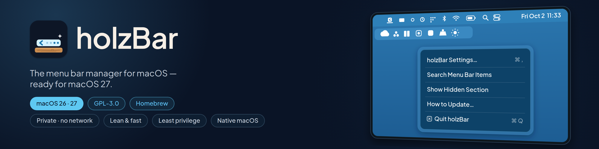
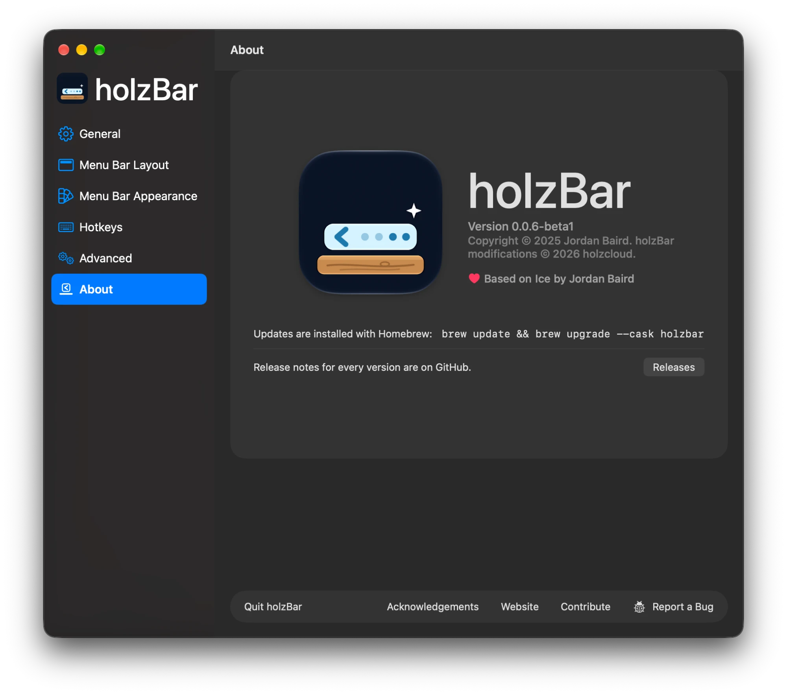

<div align="center">



<br>

[](https://github.com/holzcloud/holzBar/releases)
[](#-install)
[](#-macos-27)
[](#-principles)
[](LICENSE)
[](https://holzcloud.ch/holzbar)
[](https://github.com/sponsors/holzcloud)

**holzBar** keeps your menu bar tidy: hide what you don't need, reveal it when you do,<br>
and make the bar look the way you like — on the notch, on every display, on macOS 27.

**[🌐 holzcloud.ch/holzbar](https://holzcloud.ch/holzbar)**

[Install](#-install) · [Principles](#-principles) · [macOS 27](#-macos-27) · [Features](#-features) · [Gallery](#-gallery) · [Credits](#-credits)

</div>

---

> [!IMPORTANT]
> ### 🪵 holzBar is a fork of the wonderful [Ice](https://github.com/jordanbaird/Ice) by [Jordan Baird](https://github.com/jordanbaird)
> Ice is one of the best menu bar managers ever made for the Mac, and nearly everything you see here is Jordan's work.
> holzBar only keeps it going on macOS 27 while upstream development is slow. **If you enjoy holzBar, please ⭐ star
> [Ice](https://github.com/jordanbaird/Ice) and consider [sponsoring Jordan](https://github.com/sponsors/jordanbaird).**
> holzBar is independent and not affiliated with or endorsed by the Ice project.

## ✨ Why holzBar?

holzBar is a community fork of [Ice](https://github.com/jordanbaird/Ice) by Jordan Baird. Ice is a fantastic tool, but its development has slowed down — and macOS 27 broke it for most people. holzBar picks it up from there:

| | |
|---|---|
| 🪵 **Works on macOS 27** | New backend for the redesigned menu bar drawn by `MenuBarAgent`. |
| 🍺 **Homebrew first** | Install and update with one command. |
| 🔐 **No more permission loop** | A stale permission can be reset right from the permissions window. |
| 🌲 **Actively maintained** | Fixes land here instead of waiting upstream. |
| ✨ **More features** | Profiles, groups, spacers, a black menu bar, URL commands, settings sync — [see below](#-features). |

## 🔒 Principles

Every change to holzBar follows four rules — without taking a feature away:

- **Modern** — written the way a macOS app is written in 2026: current Swift, Swift concurrency and current SwiftUI and AppKit APIs. Outdated APIs are replaced as the code is touched.
- **Lean and fast** — as little CPU, energy, memory and disk as possible; no polling where macOS sends an event; a small app that launches fast.
- **Private** — holzBar never connects to the network: no telemetry, no analytics, no crash reports, no update checks, no remote content. The only exception is a link you click, which opens in your browser. Your data stays on your Mac and out of the logs.
- **Least privilege** — holzBar asks only for the permissions a feature really needs, when it needs them, and says why.

Where holzBar doesn't meet a rule yet, that is a bug to fix — for example, it still asks for Accessibility and Screen Recording together on the first launch.

## 🚀 Install

### Homebrew <sub>(recommended)</sub>

```sh
brew tap holzcloud/holzbar https://github.com/holzcloud/holzBar
brew trust --cask holzcloud/holzbar/holzbar
brew install --cask holzbar
```

`brew trust` is needed once: Homebrew only installs casks from third-party taps that you have trusted.

Update with:

```sh
brew update && brew upgrade --cask holzbar
```

### Coming from holzIce

holzIce is now holzBar. If you installed holzIce with Homebrew, trust the new cask name once, then update as usual:

```sh
brew trust --cask holzcloud/holzice/holzbar
brew update && brew upgrade --cask holzbar
```

Your tap `holzcloud/holzice` keeps working: Homebrew knows the cask was renamed and moves your install to `holzbar` during `brew update`. The new trust is needed because Homebrew trusts casks by name and only loads a renamed cask you have trusted; trusting `holzcloud/holzice/holzice` does not help, and `brew install --cask holzice` asks you to trust `holzbar`. If you ran `brew update` before trusting it, run `brew migrate --cask holzice` once after `brew trust`. Until the first holzBar release there is nothing new to download; you keep holzIce 0.0.5 under the new name.

To switch to the new tap name instead (recommended for a fresh install):

```sh
brew untap --force holzcloud/holzice
brew tap holzcloud/holzbar https://github.com/holzcloud/holzBar
brew trust --cask holzcloud/holzbar/holzbar
brew install --cask holzbar
```

On its first launch, holzBar takes over holzIce's settings, layout profiles, item images and iCloud sync file, and offers to quit holzIce. Then:

- macOS asks for Accessibility and Screen Recording again, because holzBar is a new app to it.
- Turn on **Launch at login** again.
- `holzice://` URLs and the old Raycast scripts keep working; the new scripts use `holzbar://`.
- Sync between Macs continues once every Mac runs holzBar.

### If macOS says holzBar "can't be opened"

holzBar is signed ad hoc, without an Apple Developer ID. The Homebrew cask removes the quarantine flag for you, but if you downloaded the zip yourself — or macOS still blocks the app — take it out of quarantine:

```sh
xattr -dr com.apple.quarantine /Applications/holzBar.app
```

Then open holzBar again. Alternatively: open it once, then go to **System Settings → Privacy & Security** and click **Open Anyway** next to the holzBar message.

> [!NOTE]
> holzBar replaces the original Ice — quit Ice and run `brew uninstall --cask jordanbaird-ice` first if you have it. Two menu bar managers must never run at the same time; holzBar offers to quit Ice, Bartender or Hidden Bar when it finds one running.
> Your Ice settings (layout, hotkeys, appearance) are imported automatically on the first launch.

### Build from source

Requires Xcode 26.6, which runs on macOS Tahoe 26.2 or later. CI builds with the same Xcode (pinned in `.github/actions/select-xcode`); holzBar itself runs on macOS 14 or later.

```sh
git clone https://github.com/holzcloud/holzBar
cd holzBar
Scripts/install.sh            # installs to ~/Applications
```

## 🪵 macOS 27

macOS 27 no longer draws menu bar items as separate windows — `MenuBarAgent` draws them all into one bar. holzBar ships a dedicated backend for it (from [jordanbaird/Ice#995](https://github.com/jordanbaird/Ice/pull/995)):

- **Hiding** via assessment-mode assertions, with per-app sections
- **Item discovery** through Accessibility instead of window lists
- **holzBar Shelf** with real item images and even spacing
- **Layout editor** that assigns apps to sections — your old layout is carried over on first launch

**Known limitations on macOS 27**

- Items can't be reordered on the bar itself — only assigned to sections.
- Opening a system item (clock, battery, Wi-Fi) while hidden items are concealed adds ~150 ms.
- After an update, macOS may ask for Accessibility again. If holzBar is stuck on the permissions window, click **Reset and Grant Again**.

## 🧰 Features

<table>
<tr>
<td valign="top" width="50%">

#### Menu bar items
- ✅ Hide items in a hidden and an always-hidden section
- ✅ Show on hover, click or scroll (trackpad **and mouse wheel**)
- ✅ Automatic rehide
- ✅ Drag-and-drop layout editor
- ✅ **Layout profiles** — "Work", "Home", … one click or URL away
- ✅ **Groups** — several items behind an icon of their own
- ✅ **Spacers** — empty items of adjustable width
- ✅ **Choose where new items appear**
- ✅ Search menu bar items
- ✅ Item spacing <sub>BETA</sub>

</td>
<td valign="top" width="50%">

#### holzBar Shelf
- ✅ Hidden items in a bar below the menu bar
- ✅ **Only on the built-in display or on displays with a notch**
- ✅ **Shows items the notch covers**

#### Appearance
- ✅ Tint, shadow, border, rounded and split shapes
- ✅ **Black menu bar that hides the notch**
- ✅ **Rounded screen corners**

</td>
</tr>
<tr>
<td valign="top" width="50%">

#### Automation
- ✅ **Show hidden items when the battery is low or the network drops**
- ✅ **`holzbar://` URL commands** and [Raycast script commands](Integrations/Raycast)
- ✅ Hotkeys for sections, search, the holzBar Shelf, app menus, **auto-rehide** and **a quick peek**

</td>
<td valign="top" width="50%">

#### Settings
- ✅ **Export and import** all settings
- ✅ **Sync between Macs** through iCloud Drive
- ✅ **Imports your Ice settings** on first launch
- ✅ Launch at login

</td>
</tr>
</table>

### holzBar vs. Ice

| | Ice 0.11.12 | holzBar |
|---|:---:|:---:|
| macOS 14 – 26 | ✅ | ✅ |
| **macOS 27** | ❌ | ✅ |
| Install and update with Homebrew | ✅ | ✅ |
| Updates | Sparkle (dialog can hang on macOS 26) | Homebrew |
| No network connections (no update checks, telemetry or analytics) | ❌ | ✅ |
| Hidden and always-hidden sections, Ice Bar / holzBar Shelf, search, appearance | ✅ | ✅ |
| Layout profiles | ❌ | ✅ |
| Groups and spacers | ❌ | ✅ |
| Choose where new items appear | ❌ | ✅ |
| Bar only on some displays, notch overflow | ❌ | ✅ |
| Black menu bar, rounded screen corners | ❌ | ✅ |
| Show hidden items on low battery or when offline | ❌ | ✅ |
| URL commands and Raycast | ❌ | ✅ |
| Export, import and sync settings | ❌ | ✅ |
| Keep Live Activities visible | ❌ | ✅ <sub>experimental</sub> |
| Show on scroll with a mouse wheel | ❌ | ✅ |
| Fix for the permissions loop | ❌ | ✅ |
| Fixes from 280 open bug reports | — | [see the list](docs/upstream-bugs.md) |
| Signed with a Developer ID | ✅ | ❌ (ad hoc; the cask handles it) |

## 🖼 Gallery

<sub>These screenshots were taken when holzBar was called holzIce and show that name until they are retaken.</sub>

<p align="center"></p>

<table>
<tr>
<td width="50%" valign="top"><b>Hidden</b> — only holzBar's dot in the menu bar<br></td>
<td width="50%" valign="top"><b>holzBar Shelf</b> — hidden items below the menu bar<br></td>
</tr>
<tr>
<td width="50%" valign="top"><b>Menu</b> — right-click the dot for settings, search and updates<br></td>
<td width="50%" valign="top"><b>Rehide and spacing</b> — automatic rehide and item spacing <sub>BETA</sub><br></td>
</tr>
</table>

<table>
<tr>
<td width="50%" valign="top"><b>Layout</b> — drag items into sections, with profiles, groups and spacers<br></td>
<td width="50%" valign="top"><b>Appearance</b> — tint, shadow, border, shapes, a black bar and rounded screen corners<br></td>
</tr>
<tr>
<td width="50%" valign="top"><b>Hotkeys</b> — a shortcut for every frequent action<br></td>
<td width="50%" valign="top"><b>Advanced</b> — the always-hidden section, Live Activities and delays<br></td>
</tr>
</table>

## 🙏 Credits



- [**Ice**](https://github.com/jordanbaird/Ice) by [Jordan Baird](https://github.com/jordanbaird) — the app holzBar is built on: its design, its features and almost all of its code. Thank you, Jordan! 💙 If you like it, [sponsor Jordan](https://github.com/sponsors/jordanbaird) or [buy him a coffee](https://www.buymeacoffee.com/jordanbaird).
- [**RabenkoYevhenii**](https://github.com/RabenkoYevhenii) — the macOS 27 backend ([jordanbaird/Ice#995](https://github.com/jordanbaird/Ice/pull/995)).

## 📄 License

holzBar is available under the [GPL-3.0 license](LICENSE), like Ice. See [NOTICE](NOTICE) for attribution and a summary of the changes made in this fork.
