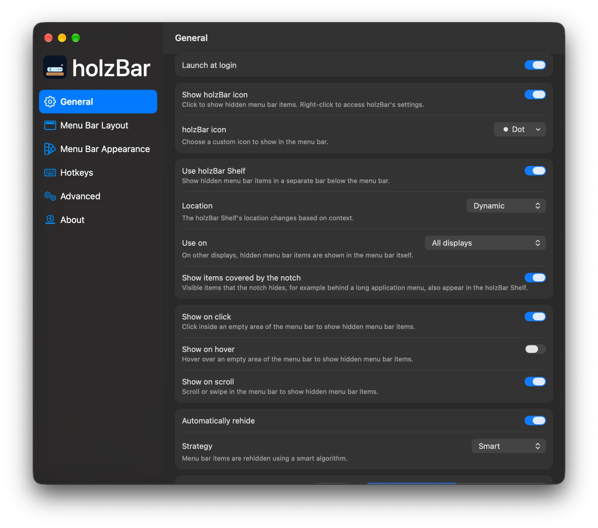
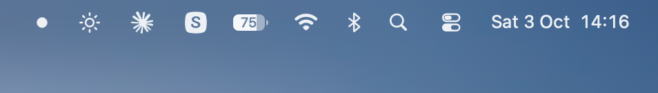
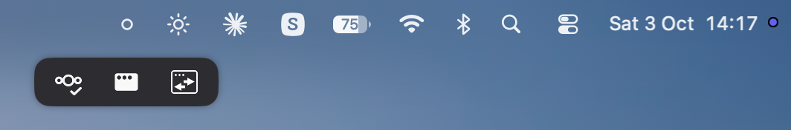
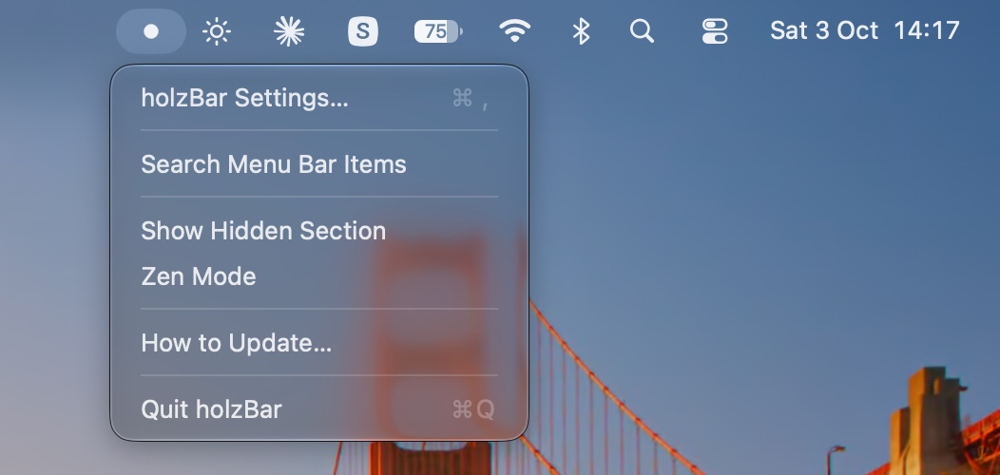
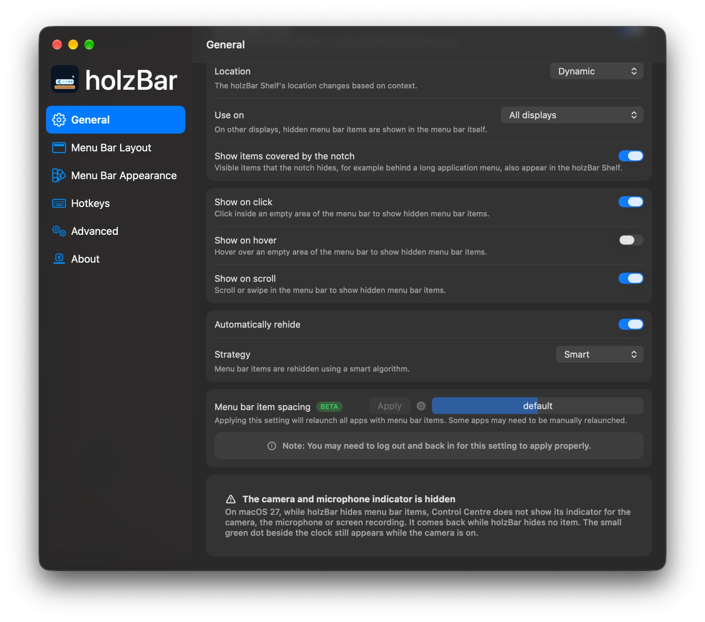
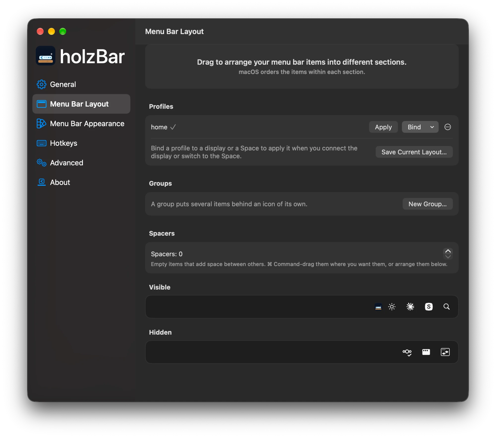
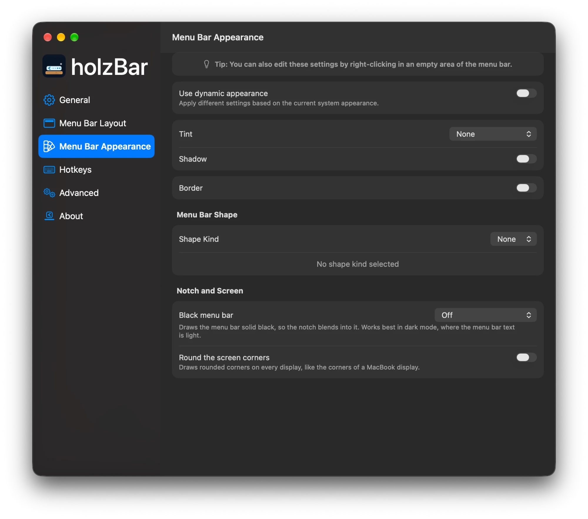
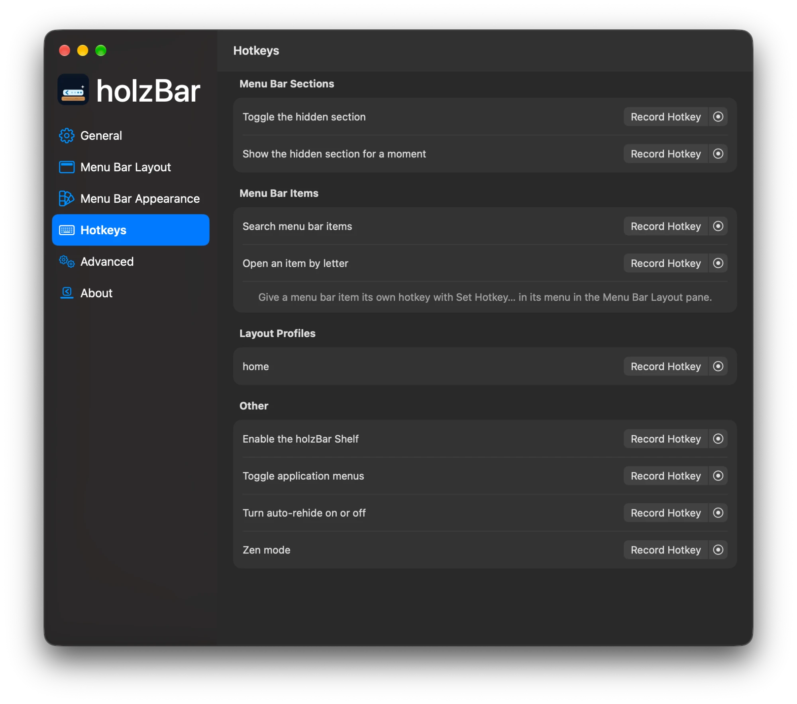
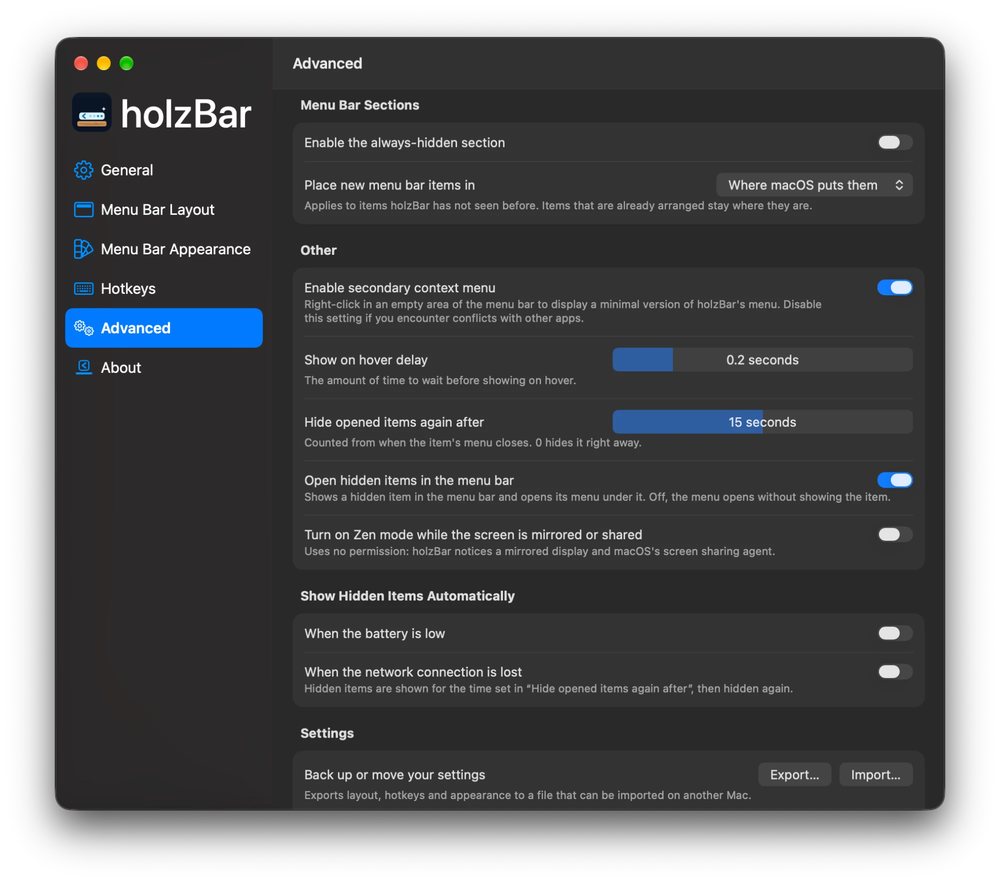

# Features

<table>
<tr>
<td valign="top" width="50%">

#### Menu bar items
- ✅ Hide items in a hidden and an always-hidden section
- ✅ Show on hover, click or scroll (trackpad **and mouse wheel**)
- ✅ Automatic rehide
- ✅ Drag-and-drop layout editor
- ✅ **Layout profiles** — "Work", "Home", … one click, hotkey or URL away
- ✅ **Profiles bound to a display or a Space** — applied when you connect the display or switch to the Space
- ✅ **Groups** (folders) — several items behind an icon of their own, in a colour and with a symbol or image of your choice
- ✅ **Item images of your choice** — give any item its own picture, or its app's icon; without Screen Recording, the holzBar Shelf and the search show app icons
- ✅ **Spacers** — empty items of adjustable width
- ✅ **Choose where new items appear**
- ✅ **Keeps items in their section after app updates, title changes and display changes**
- ✅ Search menu bar items — by abbreviation ("cc" for Control Centre) and despite typos
- ✅ **Open an item by letter** — a hotkey shows a letter under every item; type it to open the item's menu
- ✅ **Keyboard and VoiceOver** — arrange items in the Layout pane with the arrow keys, undo with ⌘Z, move items with VoiceOver actions
- ✅ **Opened items stay** up to 30 s after their menu closes — or open without showing the item at all
- ✅ **Show When It Changes** — a marked item shows for 5 s when its title or value changes
- ✅ **Privacy indicators stay visible** — the camera and microphone indicator, the FaceTime item and the Screenshot tool's recording button can be moved, never hidden macOS 14 to 26
- ✅ Item spacing BETA

</td>
<td valign="top" width="50%">

#### holzBar Shelf
- ✅ Hidden items in a bar below the menu bar
- ✅ **Only on the built-in display or on displays with a notch**
- ✅ **Shows items the notch covers**
- ✅ **Works from the keyboard** — open it with its hotkey, then the arrow keys, Return and Escape

#### Appearance
- ✅ Tint, shadow, border, rounded and split shapes
- ✅ **Black menu bar that hides the notch**
- ✅ **Rounded screen corners**
- ✅ **Dashed and dotted borders**
- ✅ **Tints from the wallpaper or the accent colour, and the system's glass** glass on macOS 26 and later

</td>
</tr>
<tr>
<td valign="top" width="50%">

#### Automation
- ✅ **Show hidden items when the battery is low or the network drops**
- ✅ **Zen mode** — one hotkey, menu item, URL or Shortcuts action keeps hidden items hidden; optionally on while the screen is mirrored or shared, without any permission
- ✅ **Shortcuts actions** — Zen mode, show or hide a section, apply a profile, open an item by name, search
- ✅ **`holzbar://` URL commands** and [Raycast script commands](../Integrations/Raycast)
- ✅ Hotkeys for sections, search, the holzBar Shelf, app menus, **auto-rehide**, **a quick peek**, **Zen mode**, **each layout profile** and **each menu bar item** — a combination another holzBar hotkey already uses moves only when you choose **Replace**

</td>
<td valign="top" width="50%">

#### Settings
- ✅ **Export and import** all settings
- ✅ **Imports your Ice settings** on first launch
- ✅ **Alerts in Settings are sheets** on its window, so holzBar keeps working while one is open
- ✅ Launch at login
- ✅ **English, German, French, Italian and Romansh** — holzBar follows your Mac's language; choose another one for holzBar alone in System Settings → General → Language & Region → Applications

</td>
</tr>
</table>

## macOS 27

macOS 27 no longer draws menu bar items as separate windows — `MenuBarAgent` draws them all into one bar. holzBar ships a dedicated backend for it (from [jordanbaird/Ice#995](https://github.com/jordanbaird/Ice/pull/995)):

- **Hiding** via assessment-mode assertions, with per-app sections
- **Item discovery** through Accessibility instead of window lists
- **holzBar Shelf** with real item images and even spacing
- **Layout editor** that assigns apps to sections — your old layout is carried over on first launch
- **A second display** works like the first: hovering and clicking items there opens their menus instead of revealing hidden items
- **Notched MacBooks**: holzBar's icon is kept out from under the notch, and items folded beside the notch come back on a wider display
- **No screenshots under the bar**: no screen-recording indicator when items are shown or hidden, and a click on the clock no longer flashes hidden items
- **Split shape** that follows the icons, on every display
- **A dot on holzBar's icon** while hidden items are concealed and an app uses the microphone (orange) or the camera (green), in place of Control Centre's indicator. On by default in Settings → General, with no permission; the icon appears for the dot even when **Show holzBar icon** is off

**Known limitations on macOS 27**

- Items can't be reordered on the bar itself — only assigned to sections.
- Opening a system item (clock, battery, Wi-Fi) while hidden items are concealed adds ~150 ms.
- **Control Centre's privacy indicator is hidden while items are hidden.** Its indicator for the camera, the microphone and screen recording is not shown while holzBar hides any item, and comes back while holzBar hides no item. holzBar's dot covers the microphone and the camera, not screen recording; the small green dot beside the clock still shows the camera. See [Permissions](privacy-and-permissions.md#permissions).
- Coming from 0.0.5 or earlier, macOS asks for Accessibility once more. If holzBar is stuck on the permissions window, click **Reset and Grant Again**.

## Planned next

**None of this is available yet.** It is published as numbered betas first. Plans can change; items marked *spike* are only built if a short test shows it works well and safely.

### 0.0.7: bugfixes (released)

0.0.7 is a bugfix release and adds no new features; see its [release notes](release-notes/v0.0.7.md). Settings sync is removed from the app; a redesigned sync is planned for 1.0.0 (Export… and Import… stay). System Glass and the holzBar Shelf follow Reduce Transparency and Increase Contrast; with either on they are drawn opaque with a border, and the change applies at once, with no restart. The macOS 27 Liquid Glass slider has no public API (checked in the macOS 27.0 SDK, see [macOS 27 notes](macos27.md#liquid-glass-and-transparency)), so holzBar does not follow it. Not yet checked on real macOS 26 and 27 systems.

- Cooperation with macOS 27's own overflow button, so items are not shown twice, is not in 0.0.7 and is planned for a later release.

### 0.0.8 "Automation"

**Automation**
- **Rules** that apply a profile, reveal items or switch Zen mode when a Wi-Fi network, an app, the time of day, the power source, a display or a Focus matches (all or any). The Wi-Fi name needs Location access, asked for only when you use it. *Preview: the rules, the observers and the Automation pane are built but not yet tested on a Mac; the Wi-Fi name condition is built too, and needs your test of the Location prompt.*
- **URL and Shortcuts for rules** (*Preview*): `holzbar://automation/enable/<name>` and `/disable/<name>` ask first, and Shortcuts can turn a rule on or off and list the rules that are active. Rules are created and edited only in the settings.
- **Focus filter** (*Preview*): add the holzBar filter to a Focus in System Settings to apply a layout profile while that Focus is on; the previous profile comes back when it ends. Whether macOS calls the filter on your Mac is the open question of this preview.
- **Per-item conditions**: show a single item only while a condition holds, for example while a VPN is connected.
- **Scripts** as a rule condition or action, and **hooks** that run before and after a profile is applied: only from a folder you choose, pinned by hash, run only after you confirm.

**Safety and convenience**
- **Layout snapshots** (*Preview*) taken automatically when the bar settles, once a day and before a profile rearranges it, with a preview and a one-click restore that can be undone; kept for 30 days, on this Mac only. Not tested on a Mac yet.
- **Share a profile** (*Preview*) as a small validated file: only the applications you leave checked and their sections, no display, Wi-Fi, hotkey or other setting, and no code. Importing adds the profile to the list and moves nothing until you apply it. Double-clicking a `.holzbarprofile` in Finder is not set up yet; use Import Profile in Menu Bar Layout.
- **Touch ID or password** to show hidden items (*Preview*), in Advanced: hover, click, hotkeys, the Shelf, the search, URLs and Shortcuts ask once, then a minute of grace; your own safety rules (low battery, offline, rules, items you chose) do not ask. Turning it off asks too. It keeps a bystander away from your hidden items; it is not protection against someone who knows your password.
- **Revoke permissions in Settings** (*Preview*): a button per permission that withdraws it again (for holzBar's own entry only) or opens the right System Settings pane, so you never have to hunt for it.
- **Copy diagnostics** (*Preview*): in About, a report of versions and counts you read before you copy it; no names of items, apps, profiles or networks, no paths; nothing is sent.
- **First-launch assistant** that proposes an arrangement from static facts, skippable and re-runnable.
- **Works without Screen Recording** (*Preview*): the Menu Bar Layout pane, the Shelf and the search show app icons instead of live pictures, with an offer to allow Screen Recording for the pictures.
- **System items pinned visible** (*Preview*, macOS 26 and earlier): profiles, restored layouts and rules leave the clock, battery, Wi-Fi, Control Center and sound where they are; you can still move them yourself.
- More **menu bar styles** (pills, outlines, gradients), as far as macOS 27 allows.

**Polish**
- Reordering in the Layout pane with SwiftUI's new reordering API, only if clearly better. *Spike.*
- A keyboard and VoiceOver audit of every pane.
- Swift 6.4 clean-up without behaviour changes.

### 0.0.9

The release starts with the **design system**: one Liquid Glass look (holzBar's blue, dark and light equally designed) and a new Settings window with a sidebar and a gallery of module cards. Every later screen follows it.

**Automation**
- **Widgets**: menu bar items of your own with text from permission-free sources (CPU load, memory, battery, free disk space, a countdown) and a Shortcut button
- **AppleScript dictionary** to show, hide, switch profiles and turn rules on or off, and **App Intents** for Shortcuts and Siri.
- **Command palette**: one hotkey opens a panel to run any holzBar action.
- A **keep-awake** action (no permission needed) and a **focus mode** hotkey that hides everything except chosen items.
- **More rule triggers**: VPN, Bluetooth, audio, camera and microphone in use, Energy Mode. Each one asks only for the permission it needs, when you use it.

**Convenience**
- **Usage suggestions** (opt-in): suggests hiding items you never click; counters stay on your Mac and can be erased with one click.
- **Smooth show and hide**, respecting Reduce Motion.
- Replacement items for Apple items that macOS 27 cannot hide, and hiding system items such as Clock and Control Center.

**Look**
- **Shelf layouts**: a grid and a vertical layout for the holzBar Shelf.
- **Moods**: saved looks (appearance) that switch per display or time.
- More **menu bar styles** (single, paired, sections, Apple-logo style) as far as macOS 27 allows.

**Polish**
- A Control Center control to toggle Zen mode or apply a profile. *Spike, optional.*

### 1.0.0 (first stable release)

- **Settings sync between your Macs** through any folder they sync (iCloud Drive, Nextcloud, Dropbox, OneDrive, Syncthing, a network share), **redesigned from scratch**, designed not to lose or silently overwrite a change.
- **Notch hub**: a panel at the notch (at the top centre on Macs without one) with Now Playing and lyrics, calendar and meetings (Calendar access asked when you switch it on), live activities, timers, a file drop, display controls and AirPods and accessory alerts. Notifications in the hub only if a feasibility test shows it can be done; macOS has no public API for it.
- **Floating bar** for hidden items, at an icon, at the screen edge or under the cursor.
- **Smart Categories**: items sorted by static facts such as system, network or media.
- **Count badges**: the number of hidden items on the holzBar icon.
- Up to **20 languages**, with a review process for the translations.

### 1.1.0: system monitor

CPU, GPU, memory, network, disk and power readouts in the menu bar and in the hub, connected devices with battery levels, and alerts when CPU, temperature or disk cross a limit.

### 1.2.0: launcher and tools

An app launcher and search panel, file search through Spotlight, a calculator and unit converter (no currencies, because that needs the network), an emoji picker (no GIFs), text snippets, quick actions for system commands and Shortcuts, a radial menu, a scratchpad, and a tool to end a process or the one using a port.

### 1.3.0: clipboard

Clipboard history (opt-in, local, password managers excluded, erasable), paste as plain text, cut and paste in Finder, and clean URLs without tracking parameters.

### 1.4.0 and later (order open)

Window management (app switcher, Dock previews, layouts), mouse and keyboard tweaks (scroll direction, smooth scrolling, no acceleration, mouse button shortcuts, trackpad middle click, shortcut management), sound (per-app volume, output switcher, microphone mute, music app blocker), energy and display (extra brightness, display tools, cleaning mode), capture (screenshots, text from the screen, screen and GIF recording, colour picker, measure, QR, camera preview), system tools (cleanup scan, app uninstaller, Homebrew manager, wallpaper tools, focus timer) and text tools with on-device AI (translation, dictation, grammar fix, agent and workflows).

### Principles for every module

Each module is optional and costs nothing while it is off. It asks for its permission only when you switch it on, and says why. No module uses the network. **All AI features run on your Mac with Apple's own on-device models.** Cloud features, weather, speed tests, fan control, a charge limit and a hosts-file blocker are not planned.

The "holzBar vs. Ice and Thaw" table above marks these with 🔜 and the release.

## Gallery

<table>
<tr>
<td width="50%" valign="top"><b>Hidden</b> — only holzBar's dot in the menu bar </td>
<td width="50%" valign="top"><b>holzBar Shelf</b> — hidden items below the menu bar </td>
</tr>
<tr>
<td width="50%" valign="top"><b>Menu</b> — right-click the dot for settings, search, Zen mode and updates </td>
<td width="50%" valign="top"><b>Rehide and spacing</b> — automatic rehide and item spacing BETA </td>
</tr>
</table>

<table>
<tr>
<td width="50%" valign="top"><b>Layout</b> — drag items into sections, with profiles, groups and spacers </td>
<td width="50%" valign="top"><b>Appearance</b> — tint, shadow, border, shapes, a black bar and rounded screen corners </td>
</tr>
<tr>
<td width="50%" valign="top"><b>Hotkeys</b> — a shortcut for every frequent action, profile and item </td>
<td width="50%" valign="top"><b>Advanced</b> — new items, delays, Zen mode, automatic reveal and settings backup </td>
</tr>
</table>
